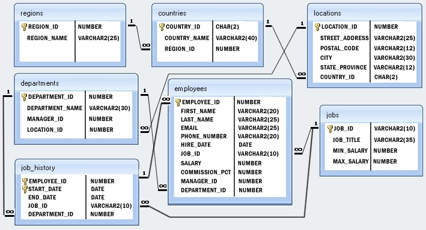

# HR Database practice

###This is a Codecool SQL project.

We've been practicing the following things on a provided database:  
* sub-selects
* GROUP BY statement
* aggregate functions
* sorting
* different join types
* views
* insert with select
* DISTINCT

The EER model of the database:

